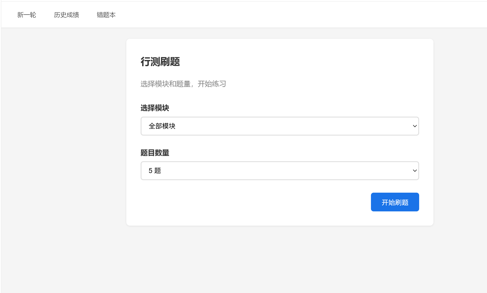
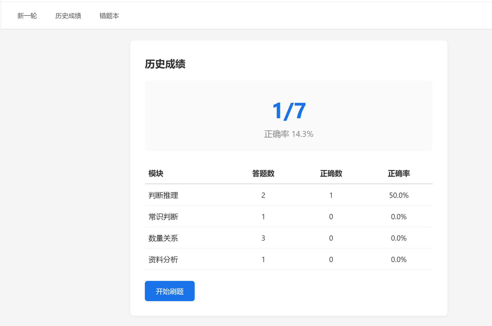
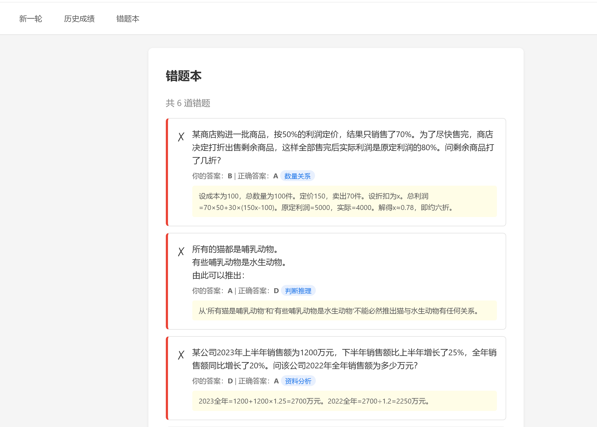

# 行测刷题小程序

一个基于 Flask 的行测刷题工具，支持言语理解、数量关系、判断推理、资料分析、常识判断五大模块。

## 功能

- 随机抽题，每轮 5 道
- 逐题作答，实时判对错
- 答题结果展示 + 解析
- 错题本自动收录

## 技术栈

- Python + Flask
- SQLite
- Jinja2 模板

## 运行

pip install flask
python app.py

然后访问 http://127.0.0.1:5000
在线体验：https://你的用户名.pythonanywhere.com

## 页面展示

